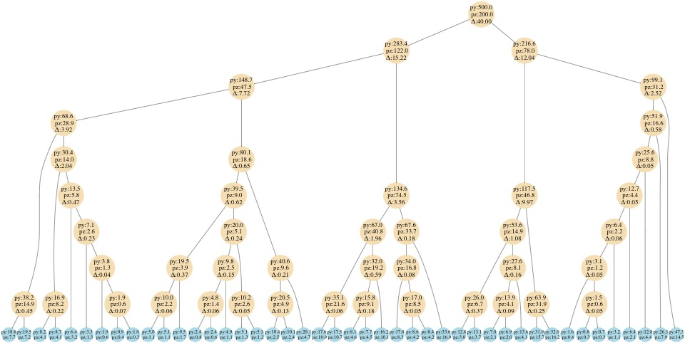

# Toy Jets Shower

### **Kyle Cranmer, Sebastian Macaluso and Duccio Pappadopulo**

Note that this is an early development version. 

 

## Introduction

In this notes, we provide a standalone description of a generative model to aid in machine learning (ML) research for jet physics. The motivation is to build a model that has a tractable likelihood, and is as simple and easy to describe as possible but at the same time captures the essential ingredients of parton shower generators in full physics simulations.  The aim is for the model to have a python implementation with few software dependencies.

Parton shower generators are software tools that encode a physics model for the simulation of jets that are produced at colliders, e.g. the Large Hadron Collider at CERN.
Jets are a collimated spray of energetic charged and neutral particles. Parton showers generate the particle content of a jet, going through a cascade process, starting from an initial unstable particle. In this description, there is a recursive algorithm that produces binary splittings of an unstable parent particle into two children particles, and a stopping rule. Thus, starting from the initial unstable particle, successive splittings are implemented until all the particles are stable (i.e. the stopping rule is satisfied for each of the final particles). We refer to this final particles as the jet constituents.

As a result of this *showering process*, there could be many latent paths that may lead to a specific jet (i.e. the set of constituents). Thus, it is natural and straightforward to represent a jet and the particular showering path that gave rise to it as a binary tree, where the inner nodes represent each of the unstable particles and the leaves represent the jet constituents. 

## Model description

Our model implements a recursive algorithm to generate a binary tree, whose leaves are the jet constituents. Jet constituents in full physics simulations are described in terms of a 4 dimensional vector that specifies their energy *E* and spatial momentum **p**, which determines the direction of motion. 
We want our model to represent the following set of features:

- Momentum conservation: the total momentum of the jet (the momentum of the root of the tree) is obtained from adding the momentum of all of its constituents.

- Running of the splitting scale Delta: each splitting is characterized by a scale that decreases when evolving down the tree from root to leaves.

We also want our model to lead to a natural analogue of the generalized k_t clustering algorithms for the generated jets. These algorithms are characterized by

- Permutation invariance: the jet momentum should be invariant with respect to the order in which we cluster its constituents.

- Distance measure: the angular separation between two jet constituents is typically used as a distance measure among them. In particular, traditional jet clustering algorithms are based on a measure given by d_{ij} ~  Delta R_{ij}^2, where Delta R_{ij} is the angular separation between two particles.

As a result, we build our model as follows. Each node of the jet tree represents a particle and encodes its momentum vector. During the generative process, starting from the root of the tree, each parent node is split, generating a left (L) and a right (R) child. The L (R) child's momentum is obtained from subtracting (adding) a vector of magnitude Delta to half of the parent's momentum vector. This prescription ensures *momentum conservation* and *permutation invariance*.

We consider a 2D model to be able to define an angular *distance measure*. Also, the angular separation between a parent and its L/R child's momentum is expected to decrease as the physics shower moves forward from the root to the leaves of the tree. The magnitude of the momentum of each node is also expected to drop in the same way, i.e. ``the radiation gets softer when evolving down the tree".
Both requirements are satisfied by the *running of the splitting scale Delta*, which we achieve by rescaling the value of Delta by a factor r. (r is drawn from a decaying exponential distribution each time a new splitting is produced.) This way, we also assign a Delta value to each node of the tree. 

We build our 2D model in the (y,z) plane, where *z* is the direction of the beam axis and *y* the transverse direction.(At the Large Hadron Collider, jets are produced from the collision of two beams of protons moving in opposite directions.)
We define the transverse momentum as p_T =|p_y|. We show in Fig. 1 a tree visualization plot of a sample jet generated with our model.

<!--This should be  a jpg file for the figure to be displayed-->

##### Fig. 1: Tree visualization of a sample jet generated with our model that represents a W boson jet. We show the values of **p** =(p_y,p_z) for each node and the scale Delta for the splitting of the inner nodes. The horizontal ordering of the leaves corresponds to the order in which the leaves are accessed when traversing the tree (and is not related to the particle momentum **p**).

The algorithm is outlined in more detail below:

A more detailed description of the model can be found in [`toyshower.pdf`](notes/toyshower_v4.pdf)

**Relevant Structure**:

- [`data`](data/): Dir with the trees.

<!---->
<!--    -[`likelihood.py`](showerSim/likelihood.py): Calculate the log likelihood of a splitting node and of (a branch of) a tree. There are examples on how to run it at the end of the script.-->

- [`showerSim`](showerSim/): Dir with the simulation code.

    -[`exp2DShowerTree.py`](showerSim/exp2DShowerTree.py): Parton shower code to generate the trees. 

- [`generate_jets`](scripts/generate_jets/):

    -[`generate_jets.py`](scripts/generate_jets/generate_jets.py): Calls and runs the parton shower code in [`showerSim`](showerSim/). The code could be run to get the augmented data as well.

<!---[`run2DShower.py`](showerSim/run2DShower.py): Run the parton shower code in [`showerSim`](showerSim/).-->
    
<!--- [`visualized-recursion_2D.ipynb`](visualized-recursion_2D.ipynb): Jet trees visualization.-->

##### **Running the simulation locally as a python package:**

1. Clone the ToyJetsShower repository
2. `cd ToyJetsShower`
3. `make`

<!---->

